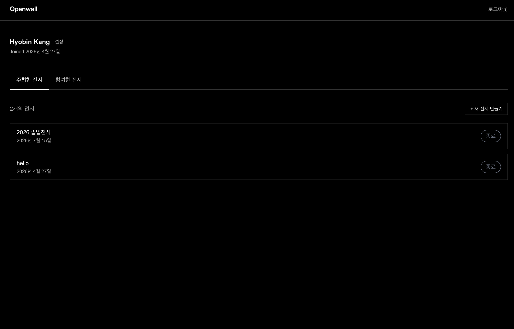

# Openwall

A web service for archiving exhibition memories. Live at **[openwall.co](https://openwall.co)**.

Organizers create an exhibition and receive a unique QR code. Visitors scan the QR and upload photos or text — no account required. Members accumulate a personal archive of every exhibition they have attended. Designed, built, and deployed by one person.

---

## Screenshots

| Visitor page | My page | QR poster |
|---|---|---|
|  |  |  |

---

## Features

- **Exhibition management** — create, edit, set dates, manage status (`draft` / `active` / `closed`), upload cover images
- **Draft save** — save an incomplete exhibition before publishing; a system slug is assigned until the organizer sets a real one
- **QR code** — each active exhibition gets a unique URL and QR code; downloadable as an A4-sized print-ready poster (2480×3508 px PNG, canvas-generated in the browser)
- **Anonymous uploads** — visitors submit photos or text without logging in; a guest name is optional
- **Personal archive** — logged-in visitors see all exhibitions they have contributed to, grouped by exhibition
- **Upload claim** — uploads made before logging in are attributed to the account after sign-in
- **Account settings** — display name editing, read-only account info (email, login provider)
- **Account deletion** — removes the organizer's exhibitions and their uploads; contributions to other exhibitions are anonymised (`uploader_id` set to `null`)

---

## Tech Stack

| Layer | Choice |
|---|---|
| Framework | Next.js 16 — App Router, Server Actions |
| Language | TypeScript 5 |
| Styling | Tailwind CSS 4 |
| Backend / DB | Supabase (PostgreSQL, Auth, Storage) |
| Hosting | Vercel |
| Transactional email | Resend (custom SMTP for Supabase Auth emails) |
| Image compression | browser-image-compression |
| QR generation | react-qr-code |

---

## Data Model

```
auth.users
    │ (CASCADE)
    ▼
profiles          id · email · name · avatar_url · created_at

profiles
    │ organizer_id (CASCADE)
    ▼
exhibitions       id · title · slug · description · cover_images[] · status
                  starts_at · ends_at · created_at

exhibitions
    │ exhibition_id (CASCADE)
    ▼
uploads           id · type · storage_path · text_content · guest_name · created_at
    │ uploader_id (SET NULL)   ← null = anonymous or account deleted
    └── profiles
```

**FK delete policies**

| FK | On parent delete |
|---|---|
| `profiles.id → auth.users` | CASCADE |
| `exhibitions.organizer_id → profiles` | CASCADE |
| `uploads.exhibition_id → exhibitions` | CASCADE |
| `uploads.uploader_id → profiles` | SET NULL |

**Storage buckets** — `covers` (exhibition cover images) and `uploads` (visitor photos), both public-read.

---

## Technical Challenges

### 1. Vercel region vs. Supabase region
**Problem:** High latency on every Server Action and DB query.
**Cause:** Vercel's default function region (`iad1`, Virginia) is geographically far from the Supabase project (Tokyo, `ap-northeast-1`).
**Solution:** Moved the Vercel project's function region to `hnd1` (Tokyo) to co-locate compute with the database.

### 2. Upload size limit
**Problem:** Photo uploads from phone cameras were rejected.
**Cause:** Vercel limits Server Action request bodies to ~4.5 MB; high-res phone photos routinely exceed this.
**Solution:** Compress images client-side with `browser-image-compression` (max 0.5 MB, max 1024 px) before the form submits.

### 3. Account deletion design
**Problem:** Deleting a user must cleanly remove owned data, anonymise other contributions, and clean up Storage — without leaving orphaned files or exposing the service role key to the client.
**Cause:** `auth.admin.deleteUser()` invalidates the session immediately, so Storage paths must be collected beforehand; DB rows need cascading deletes; other users' exhibitions must keep the uploads as anonymous.
**Solution:** Server Action collects all Storage paths first, calls `deleteUser()` (DB `CASCADE` removes all rows; `SET NULL` anonymises contributions to others' exhibitions), then deletes Storage files best-effort. User identity is always verified server-side via `supabase.auth.getUser()`.

### 4. UTC storage vs. KST comparison
**Problem:** Exhibitions appeared "ended" nine hours before the intended closing date in Korea.
**Cause:** `ends_at` is stored as `timestamptz` at UTC midnight when the organizer picks a date; comparing it to `new Date()` (wall-clock time in KST, UTC+9) triggers the condition too early.
**Solution:** `parseEndsAt()` adds 86,399 seconds to the stored UTC value, treating the timestamp as end-of-day KST before comparison.

---

## Running Locally

```bash
npm install
npm run dev
```

Create a `.env.local` file (see `.env.example` for variable names). Initialise the database by running `supabase/schema.sql` in the Supabase SQL editor.
