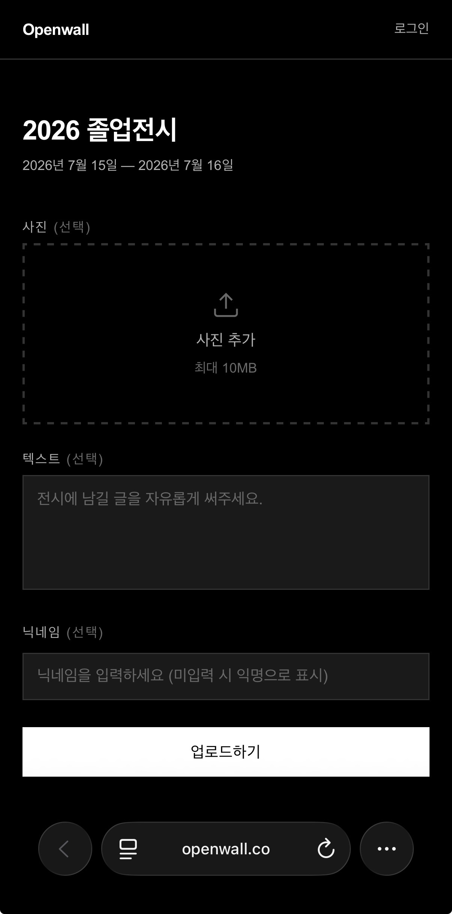

# Openwall

An archive for exhibition visits. Live at [openwall.co](https://openwall.co).

## Overview

Organizers create an exhibition and get a QR code for it. Visitors scan the code and upload a photo or a note without signing in. Members keep a personal archive of every exhibition they have contributed to. Solo project.

## Screenshots

| Visitor page | My page | QR poster |
|---|---|---|
|  |  |  |

## Features

- Exhibitions with draft / active / closed status, start and end dates, and up to 9 cover images.
- A QR code per exhibition, downloadable as an A4 poster (2480×3508 PNG drawn in the browser).
- Photo or text uploads without an account. A guest can edit the upload right after submitting it.
- Guest uploads are attributed to the account when the visitor signs in from the same tab.
- A personal archive of hosted and joined exhibitions, and a gallery page per exhibition.
- Bulk delete of uploads for organizers. Account deletion removes owned exhibitions and anonymises contributions elsewhere.

## Stack

Next.js 16 (App Router, Server Actions), TypeScript, Tailwind CSS 4.
Supabase (Postgres, Auth, Storage, RLS), Vercel (functions in `hnd1`), Resend as the SMTP provider for Supabase Auth emails.

## Architecture

Public reads are allowed by RLS. Draft exhibitions are visible only to their organizer.
Visitor uploads and all upload deletions go through Server Actions. Each action checks ownership first, then writes with the service role. There are no public insert policies.
Organizers write their own exhibitions with their session under RLS. Cover images go from the browser to Storage, restricted to the user's own folder (`{user_id}/…`).

| Foreign key | On delete |
|---|---|
| `profiles.id → auth.users` | CASCADE |
| `exhibitions.organizer_id → profiles` | CASCADE |
| `uploads.exhibition_id → exhibitions` | CASCADE |
| `uploads.uploader_id → profiles` | SET NULL (upload stays, becomes anonymous) |

## Engineering notes

**Closing public write paths.** The `uploads` table and the `uploads` bucket had anon INSERT policies, so anyone with the public key could write around the app. Writes now run only in a Server Action with the service role, and both public policies are removed. Guest edits and claims used to trust the upload id alone, which let anyone who saw an id overwrite or take over the upload. Guests now get an edit token; only its SHA-256 hash is stored, and edits and claims require a match. Storage paths sent by the client are accepted only inside the caller's own folder, SVG is rejected, and both buckets are limited to 10 MB and seven image MIME types.

**Keeping Storage consistent with the database.** Covers were uploaded the moment they were picked, so removing one, leaving the page, or a failed save left files behind, and orphaned files built up. Covers now upload on save, and a failed upload or save deletes the files it just created. Deletes follow one order: collect paths, confirm the row delete, then remove the files. A `remove()` blocked by RLS returns an empty result with no error, so earlier failures went unnoticed. The result is now compared with the requested paths and any missing file is logged.

**Vercel's 4.5 MB request limit.** Original phone photos sent to a Server Action were rejected with 413 before the handler ran. `serverActions.bodySizeLimit` raises Next.js's own limit but not the platform's. Photos are now compressed in the browser to 2 MB / 2048 px before sending, and the file sent is capped at 4 MB. GIFs are sent as-is to keep animation.

**Function region.** Functions ran in `iad1` while the database is in Tokyo, so every request made several round trips across the Pacific. Functions now run in `hnd1`. Measured from Korea, median TTFB on a public exhibition page went from 782 ms to 246 ms, and median total time from 1,064 ms to 247 ms. One run of 20 sequential requests per region on 2026-09-30, both through the Seoul edge.

**Date-only values across time zones.** Start and end dates are picked as dates and stored as UTC midnight. The first fix added a day minus one second in UTC, which moved the end to 08:59:59 KST the next day, nine hours late. Status is now computed from the `YYYY-MM-DD` part alone, with boundaries at `00:00:00+09:00` and `23:59:59.999+09:00`, so server and browser time zones do not matter. Dates are also formatted from that string, which fixes a one-day shift in browsers set to US time zones.

## Local setup

```bash
npm install
cp .env.example .env.local   # fill in the Supabase URL, anon key, and service role key
npm run dev
```

Create the tables, policies, and buckets by running `supabase/schema.sql` in the Supabase SQL editor.
